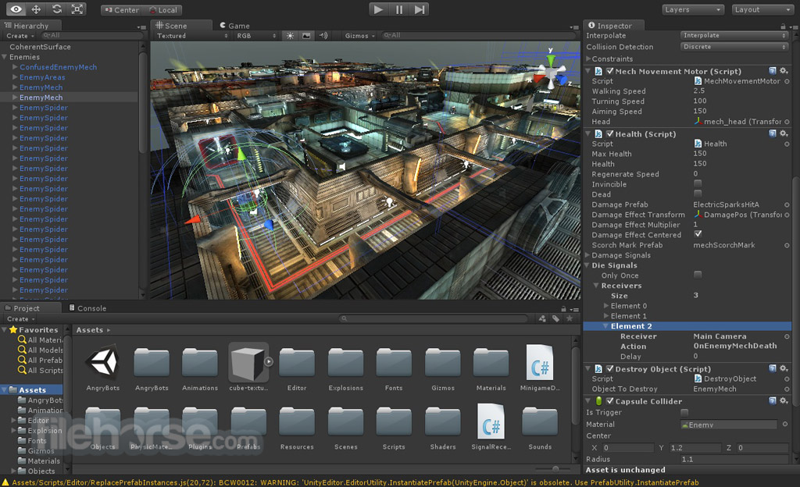

# Unity3d

### Termin održavanja:
- 1.4.2018. (nedelja 12h)

### O Unity-ju
[Unity3d](https://unity3d.com/) je višeplatformski endžin za video igre
razvijen od strane *Unity Technologies* koji je namenjen za
razvoj 2d i 3d video igara i simulacija za računare, mobilne uređaje i konzole.

### C#
Unity omogućava pisanje logike (skripti) u dva jezika:
- C\#
- UnityScript (varijanta jezika JavaScript)

U okviru kursa ćemo koristiti C\#, [ovde](https://www.youtube.com/watch?v=x_9lfHjYtVg&list=PL0EE421AE8BCEBA4A) možete pronaći tutorial o jeziku.

### Podešavanje okruženja
Unity3d:
- ArchLinux: [aur paket](https://aur.archlinux.org/packages/unity-editor/)
- Ubuntu: [deb](https://forum.unity.com/threads/unity-on-linux-release-notes-and-known-issues.350256/)

##### Editori
Preporučeno: Visual Studio Code

- [Vim](https://www.vim.org/) (plugin [YCM](https://github.com/Valloric/YouCompleteMe))
- [NeoVim](https://neovim.io/) (plugin [YCM](https://github.com/Valloric/YouCompleteMe))
- [Visual Studio Code](https://code.visualstudio.com/) (plugin [C#](https://code.visualstudio.com/docs/languages/csharp))
- [Atom](https://atom.io/) (plugin [omnisharp-atom](https://code.visualstudio.com/docs/languages/csharp))
- [MonoDevelop](https://www.monodevelop.com/)
